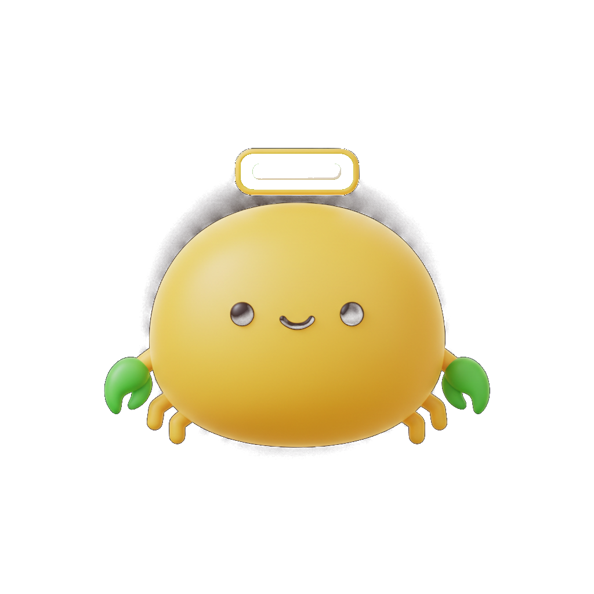

<p align="center">
  
</p>

<p align="center">
  <strong>Browser control for AI agents.</strong><br/>
  12MB Go binary. Zero config. Accessibility-first.<br/><br/>
  🦀 <em>PINCH! PINCH!</em>
</p>

<p align="center">
  
  
  
  
</p>

---

## Why

Most agent browser tools (OpenClaw, Playwright MCP, Browser Use) are tightly coupled — they only work inside their own framework. If you switch agents or want to script something in bash, you're out of luck.

Pinchtab is a standalone HTTP server. Any agent, any language, even `curl`:

```bash
# Read a page — 800 tokens instead of 10,000
curl localhost:9867/text?tabId=X

# Click a button by ref from the last snapshot
curl -X POST localhost:9867/action -d '{"kind":"click","ref":"e5"}'
```

| | Pinchtab | OpenClaw Browser |
|---|---|---|
| **Tokens per page** | **~800** (`/text`) / ~3,600 (interactive) | ~10,000+ (full snapshot) |
| Interface | HTTP — any agent, any language | Internal only |
| A11y snapshots | ✅ | ✅ |
| Element interaction | ✅ | ✅ |
| Stealth mode | ✅ | ❌ |
| Session persistence | ✅ | ❌ |
| Self-contained binary | ✅ 12MB | ❌ |

- **5-13x cheaper** than screenshots or full snapshots for read-heavy tasks ([real measurements](#token-efficiency--real-numbers))
- **Plain HTTP API** — not locked to any agent framework
- **Self-contained** — 12MB binary, launches its own Chrome, zero config
- **Stealth mode** — bypasses bot detection on major sites
- **Persistent sessions** — log in once, stays logged in across restarts

## Quick Start

### With your AI agent

> Install Pinchtab and set it up for browser automation.

Your agent can clone, build, and configure Pinchtab using the [OpenClaw skill](skill/pinchtab/SKILL.md). Just ask.

### Manual

```bash
# Build
go build -o pinchtab .

# Run (launches Chrome window — you can see and interact)
./pinchtab

# Run headless
BRIDGE_HEADLESS=true ./pinchtab
```

Chrome opens. You log into your sites. Agents drive the rest.

### First-Time Login

Pinchtab launches its own Chrome with a persistent profile at `~/.pinchtab/chrome-profile/`. The first time you run it, log into any sites you want agents to access — just do it in the Chrome window that opens. Cookies and sessions persist across restarts, so you only need to do this once.

## Features

- 🌲 **Accessibility-first** — structured tree with stable refs (`e0`, `e1`...) for click, type, read
- 🎯 **Smart filters** — `?filter=interactive` returns only buttons/links/inputs (~75% fewer tokens)
- 🖱️ **Direct actions** — click, type, fill, press, focus, hover, select, scroll by ref or CSS selector
- 🕵️ **Stealth mode** — patches `navigator.webdriver`, spoofs UA, hides automation flags
- 💾 **Session persistence** — cookies, auth, tabs survive restarts
- 📝 **Text extraction** — readability mode (strips nav/ads) or raw `innerText`
- 🔄 **Smart diff** — `?diff=true` returns only changes since last snapshot
- 📄 **Text format** — `?format=text` for indented tree (~40-60% fewer tokens than JSON)
- ⚡ **JS evaluation** — escape hatch for anything the API doesn't cover
- 📸 **Screenshots** — JPEG with quality control for visual verification

## Full API

| Method | Endpoint | Description |
|--------|----------|-------------|
| `GET` | `/health` | Connection status |
| `GET` | `/tabs` | List open tabs |
| `GET` | `/snapshot` | Accessibility tree (primary interface) |
| `GET` | `/screenshot` | JPEG screenshot (opt-in) |
| `GET` | `/text` | Readable page text (readability or raw) |
| `POST` | `/navigate` | Go to URL |
| `POST` | `/action` | Click, type, fill, press, focus, hover, select, scroll |
| `POST` | `/evaluate` | Execute JavaScript |
| `POST` | `/tab` | Open/close tabs |

### Query Parameters (snapshot)
| Param | Description |
|-------|-------------|
| `tabId` | Target tab (default: first tab) |
| `filter=interactive` | Only buttons, links, inputs |
| `depth=N` | Max tree depth |
| `diff=true` | Return only added/changed/removed nodes since last snapshot |
| `format=text` | Indented plain text instead of JSON (~40-60% fewer tokens) |

### Query Parameters (text)
| Param | Description |
|-------|-------------|
| `tabId` | Target tab (default: first tab) |
| `mode=raw` | Raw `innerText` instead of readability extraction |

## Configuration

All via environment variables:

| Variable | Default | Description |
|----------|---------|-------------|
| `BRIDGE_PORT` | `9867` | HTTP server port |
| `BRIDGE_TOKEN` | *(none)* | Bearer token for auth |
| `BRIDGE_HEADLESS` | `false` | Run Chrome headless |
| `BRIDGE_PROFILE` | `~/.pinchtab/chrome-profile` | Chrome profile directory |
| `BRIDGE_STATE_DIR` | `~/.pinchtab` | State/session storage |
| `BRIDGE_NO_RESTORE` | `false` | Skip restoring tabs from previous session |
| `CDP_URL` | *(none)* | Connect to existing Chrome instead of launching |

## Architecture

```
┌─────────────┐     HTTP :9867    ┌──────────────┐                ┌─────────┐
│  Any Agent  │ ──────────────►   │  Pinchtab    │  ── CDP ──►   │ Chrome  │
│  (OpenClaw, │  snapshot, act,   │              │                │         │
│   PicoClaw, │  navigate, eval   │  stealth +   │                │  your   │
│   curl,     │                   │  sessions +  │                │  tabs   │
│   scripts)  │                   │  a11y tree   │                │         │
└─────────────┘                   └──────────────┘                └─────────┘
```

## Why Not Screenshots?

| | Screenshots | Accessibility Tree |
|---|---|---|
| **Tokens** | ~2,000/image | ~200-500/page |
| **Speed** | Render → encode → transfer | Instant structured data |
| **Reliability** | Vision model guesses coordinates | Deterministic refs |
| **LLM requirement** | Vision model required | Any text LLM works |
| **Cost (10-step task)** | ~$0.06 | ~$0.015 |

Playwright MCP, OpenClaw, and Browser Use all default to accessibility trees for the same reason.

## Token Efficiency — Real Numbers

Measured on a live search results page:

| Method | Size | ~Tokens |
|---|---|---|
| Full a11y snapshot | 42 KB | 10,500 |
| Interactive-only (`?filter=interactive`) | 14 KB | 3,600 |
| Text extraction (`/text`) | 3 KB | 800 |
| Screenshot (vision model) | — | ~2,000 |

For read-heavy tasks (monitoring feeds, scraping search results), `/text` at ~800 tokens per page is **5x cheaper** than a full snapshot and **13x cheaper** than the same page via screenshots.

**Example: 50-page search monitoring task**

| Approach | Tokens | Est. cost |
|---|---|---|
| Screenshots (vision) | ~100,000 | $0.30 |
| Full snapshots | ~525,000 | $0.16 |
| Pinchtab `/text` | ~40,000 | $0.01 |
| Pinchtab interactive filter | ~180,000 | $0.05 |

Use `/text` when you only need content. Use `?filter=interactive` when you need to act. Use the full snapshot when you need page structure.

## Built With

| Dependency | What it does | License |
|---|---|---|
| [chromedp](https://github.com/chromedp/chromedp) | Chrome DevTools Protocol driver for Go | MIT |
| [cdproto](https://github.com/chromedp/cdproto) | Generated CDP types and commands | MIT |
| [gobwas/ws](https://github.com/gobwas/ws) | Low-level WebSocket (used by chromedp) | MIT |
| [go-json-experiment/json](https://github.com/go-json-experiment/json) | JSON v2 library (used by cdproto) | BSD-3-Clause |

Everything else is Go standard library.

## Requirements

- **Go 1.24+** (build from source) or download a [prebuilt binary](https://github.com/pinchtab/pinchtab/releases)
- **Google Chrome** or Chromium installed

## Install

```bash
# From source
go install github.com/pinchtab/pinchtab@latest

# Or clone and build
git clone https://github.com/pinchtab/pinchtab.git
cd pinchtab
go build -o pinchtab .
```

## Development

```bash
git clone https://github.com/pinchtab/pinchtab.git
cd pinchtab
go build -o pinchtab .
./pinchtab

# Run tests (38 tests)
go test ./...
```

## Security

- Set `BRIDGE_TOKEN` in production — without it, anyone on the network can control your browser
- Chrome profile persists cookies/sessions — treat `~/.pinchtab/` as sensitive
- Pinchtab binds to all interfaces by default — use a firewall or reverse proxy in exposed environments
- No data leaves your machine — all processing is local

## Contributors

### Humans

<a href="https://github.com/luigi-agosti">
  <br/>
  <sub>Luigi Agosti</sub>
</a>

### Agents

| | |
|:---:|:---:|
| <a href="https://github.com/luigiagent"></a> | <a href="https://github.com/luigiagent"></a> |
| **Bosch** | **Mario** |
| OpenClaw · Claude | OpenClaw · Claude |

## Works with OpenClaw

Pinchtab is built to work seamlessly with [OpenClaw](https://openclaw.ai) — the open-source personal AI assistant. Use Pinchtab as your agent's browser backend for faster, cheaper web automation.

<p align="right">
  
  
</p>

