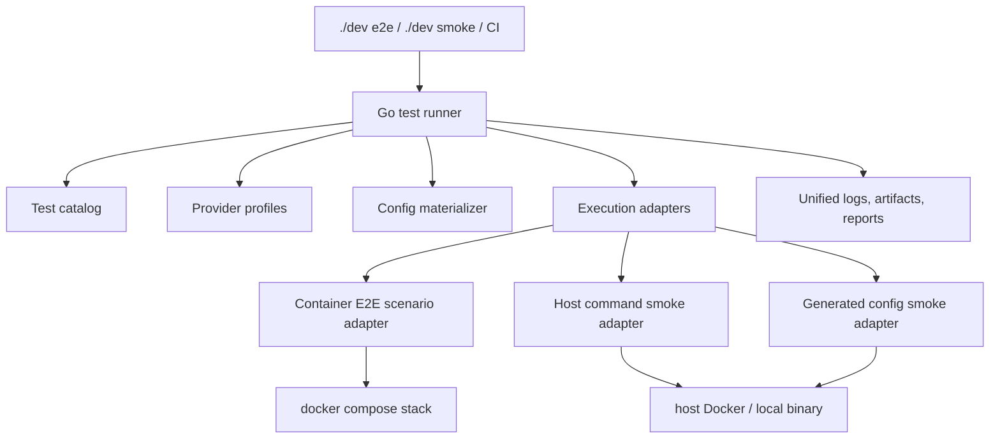

# E2E And Smoke Shared Infrastructure

Status: draft

Date: 2026-05-17

## Scope

This spec proposes a shared infrastructure layer for PinchTab E2E tests and
smoke tests. The goal is to make new coverage mostly a matter of declaring
configuration and writing the scenario-specific behavior, while the runner owns
common setup, provider selection, compose services, generated configs, reports,
logs, artifacts, and skip policy.

This covers:

- compose-backed E2E scenarios under `tests/e2e/scenarios`
- host-side Docker smoke scripts under `scripts/docker-*-smoke.sh`
- local smoke routing through `scripts/dev-smoke.sh`
- provider-specific smoke runs for Chrome and CloakBrowser
- shared shell helpers under `scripts/lib/smoke-*.sh` and
  `tests/e2e/helpers`
- Go runner code under `tests/tools/runner/internal/e2e`

It does not require rewriting every existing test immediately. The migration
should preserve today's scripts and move orchestration behind a compatible
catalog-driven runner in phases.

## Current Shape

PinchTab currently has two overlapping test orchestration systems.

The first is the Go E2E runner:

- entry point: `go run ./tests/tools/runner e2e ...`
- scenario files: `tests/e2e/scenarios/*/*.sh`
- scenario metadata: `tests/e2e/scenarios/manifest.json`
- compose stack: `tests/e2e/docker-compose-multi.yml`
- container executor: `tests/e2e/run.sh`
- runner implementation:
  - `tests/tools/runner/internal/e2e/e2e.go`
  - `tests/tools/runner/internal/e2e/runner.go`
  - `tests/tools/runner/internal/e2e/provider.go`

The Go runner already handles suite expansion, scenario discovery, compose
startup, readiness checks, explicit scenario execution, dry-run output, logs,
and reports. It also has hardcoded host Docker smoke steps for some release
image and lifecycle checks.

The second is the local smoke shell layer:

- local entry point: `scripts/dev-smoke.sh`
- host smoke scripts:
  - `scripts/docker-smoke.sh`
  - `scripts/docker-chrome-cft-smoke.sh`
  - `scripts/docker-port-conflict-smoke.sh`
  - `scripts/docker-mcp-smoke.sh`
  - `scripts/docker-browser-parity-smoke.sh`
  - `scripts/docker-cdp-attach-smoke.sh`
  - `scripts/docker-live-detection-smoke.sh`
  - `scripts/docker-zombie-soak-smoke.sh`
- shared host smoke helpers:
  - `scripts/lib/smoke-common.sh`
  - `scripts/lib/smoke-config.sh`
  - `scripts/lib/smoke-container.sh`
  - `scripts/lib/smoke-health.sh`
  - `scripts/lib/smoke-fixtures.sh`
  - `scripts/lib/smoke-endpoints.sh`
  - `scripts/lib/smoke-scenarios.sh`
  - `scripts/lib/smoke-diagnostics.sh`
  - `scripts/lib/smoke-assertions.sh`
  - `scripts/lib/smoke-multi-target.sh`
  - `scripts/lib/smoke-persistence.sh`

The shell layer is useful and pragmatic, but it has its own routing,
filtering, provider matrix, temporary config generation, artifact behavior,
and pass/fail reporting.

## Current Helper Roles

The host smoke helpers are already a partial shared infrastructure layer. The
problem is that they are only shared by shell scripts, while the Go runner has
its own planning and provider logic.

Current helper responsibilities:

- `scripts/lib/smoke-common.sh` provides base shell primitives: failure and
  skip handling, command checks, free-port selection, authenticated API calls,
  JSON assertions, screenshot assertions, and byte/file assertions.
- `scripts/lib/smoke-config.sh` writes temporary PinchTab config files for
  Chrome, CloakBrowser, and multi-target smoke runs. It owns a second copy of
  several provider defaults that also exist in the E2E runner.
- `scripts/lib/smoke-container.sh` centralizes Docker container startup and
  cleanup helpers for host smokes.
- `scripts/lib/smoke-health.sh` waits for PinchTab and fixture services to
  become reachable.
- `scripts/lib/smoke-fixtures.sh`, `smoke-endpoints.sh`,
  `smoke-scenarios.sh`, `smoke-assertions.sh`, `smoke-multi-target.sh`, and
  `smoke-persistence.sh` group repeated API flows and assertions for specific
  smoke families.

The target design keeps these helpers useful for direct shell script execution,
but moves cross-cutting concerns that affect all tests into the runner:

- which tests are selected
- which provider matrix is expanded
- which configs are generated
- which resources are required or provided
- where logs and artifacts are stored
- how results are reported

## Existing Strengths To Keep

- The Go runner is a good central control point for suite selection,
  filtering, reports, logs, compose lifecycle, and CI execution.
- `tests/e2e/run.sh` has a clean contract: it runs explicit scenario files
  passed by the runner and reports structured `E2E_RESULT` lines.
- `tests/e2e/scenarios/manifest.json` already separates scenario metadata
  from scenario code.
- The shell helper libraries hide many low-level details for host smokes:
  port selection, API calls, health checks, generated configs, fixture
  servers, screenshots, and diagnostics.
- Host smoke scripts are valuable because some checks need direct host access
  to Docker, external browser containers, release images, or local binaries.

The target design should reuse these strengths instead of replacing them with a
large new framework.

## Problems

### Metadata Is Split Across Multiple Places

Scenario metadata lives in `tests/e2e/scenarios/manifest.json`.
Host Docker smoke steps are hardcoded in Go. Local smoke groups are hardcoded in
`scripts/dev-smoke.sh`. Provider-specific host smoke behavior is hardcoded in
individual scripts. Compose service requirements are partly in the manifest,
partly inferred from scenario names, and partly embedded in runner code.

This makes it hard to answer simple questions:

- What tests belong to `./dev smoke cdp-attach`?
- Which tests run for `--provider cloak`?
- Which tests require a release image?
- Which tests require a full PinchTab service versus a medium service?
- Which tests are CI-safe and which are local opt-in checks?

### Provider And Config Generation Is Duplicated

CloakBrowser config generation exists in more than one shape:

- `tests/tools/runner/internal/e2e/provider.go` rewrites E2E config files and
  generates compose overrides for CloakBrowser.
- `scripts/lib/smoke-config.sh` generates provider configs for host smoke
  scripts with embedded Python.
- individual smoke scripts still carry setup assumptions around browser binary
  paths, DevTools ports, and Docker images.

The repeated logic increases the chance that Chrome and CloakBrowser coverage
diverges accidentally.

### Runner Behavior Is Not Uniform

Compose-backed E2E scenarios produce structured reports through the Go runner.
Host smoke scripts produce their own terminal output and artifact directories.
Some host smoke steps are visible to the Go runner, while others are only
reachable through `scripts/dev-smoke.sh`.

That split creates friction when a smoke failure needs to be compared with an
E2E failure, retried with a filter, or added to CI.

### Adding New Tests Requires Too Much Harness Knowledge

Adding a new test often requires knowing several unrelated details:

- which script entry point to use
- which helper file to source
- how to select `runner-api` versus `runner-cli`
- which compose service should be ready
- where to declare tags and services
- how to run the same case across Chrome and CloakBrowser
- how to emit results and collect artifacts
- whether to edit Go runner code, a shell router, or a manifest

The desired authoring model is:

1. declare what the test needs
2. write the scenario-specific actions and assertions
3. let the shared infrastructure handle the rest

## Goals

- Provide one catalog for E2E scenarios and smoke tests.
- Keep `./dev e2e`, `./dev smoke`, and CI behavior stable during migration.
- Let a new test be added with a scenario file plus a small metadata entry.
- Move provider, config, compose, readiness, report, log, artifact, and skip
  behavior into shared runner infrastructure.
- Support both container E2E scenarios and host-side Docker smoke commands.
- Preserve shell as a valid scenario language where it is already working.
- Make Chrome/CloakBrowser provider matrix behavior declarative.
- Make dry-run output authoritative for what will run and why.
- Keep failure artifacts easy to find and consistently named.
- Avoid requiring Docker host access from container E2E scenarios.

## Non-Goals

- Do not rewrite all tests in Go.
- Do not remove host smoke scripts before their behavior is represented in the
  runner catalog.
- Do not make every smoke test CI-blocking. Some checks should remain local or
  scheduled only.
- Do not hide product-specific assertions behind a generic DSL so much that the
  test intent becomes unclear.

## Target Architecture

Introduce a catalog-driven test runner that can plan and execute multiple test
kinds through the same suite/filter/provider/reporting path.



The Go runner remains the main orchestrator. Shell scripts remain executable
implementation units, but the runner owns selection, environment, dependency
resolution, reporting, and artifact conventions.

## Test Catalog

Add a machine-readable catalog under `tests/e2e/catalog/`.

Recommended initial files:

```text
tests/e2e/catalog/
  suites.json
  services.json
  providers.json
  tests.json
```

JSON is recommended for the first version because the repo already uses
`manifest.json`, Go support is standard, and migration can reuse existing
parsing patterns. YAML can be reconsidered later if comments and anchors become
important.

### Catalog Responsibilities

The catalog should declare:

- test id
- test kind
- suite membership
- tags
- provider matrix
- required commands
- required images
- required compose services
- readiness targets
- execution adapter
- command or scenario path
- environment variables
- timeout
- artifact policy
- CI policy
- skip policy

Example:

```json
{
  "id": "infra.dashboard-smoke",
  "kind": "e2e-scenario",
  "path": "tests/e2e/scenarios/infra/dashboard-smoke.sh",
  "suites": ["smoke", "smoke-infra"],
  "helper": "base",
  "services": ["pinchtab-full"],
  "ready": ["pinchtab-full", "fixtures"],
  "providers": ["chrome", "cloak"],
  "tags": ["dashboard", "screencast", "isolation"],
  "timeout": "60s",
  "ci": true
}
```

Example host smoke:

```json
{
  "id": "host.cdp-attach",
  "kind": "host-command",
  "command": ["bash", "scripts/docker-cdp-attach-smoke.sh", "${provider}"],
  "suites": ["smoke", "smoke-host", "smoke-cdp"],
  "providers": ["chrome", "cloak"],
  "requires": ["docker", "pinchtab-binary"],
  "provides": [],
  "artifacts": {
    "mode": "script-tempdir",
    "env": "PINCHTAB_SMOKE_ARTIFACT_DIR"
  },
  "timeout": "120s",
  "ci": false,
  "skipPolicy": "skip-if-docker-unavailable"
}
```

Example release image dependency:

```json
{
  "id": "host.release-image",
  "kind": "host-command",
  "command": ["bash", "scripts/docker-smoke.sh", "--build-only"],
  "suites": ["smoke", "smoke-host", "smoke-orchestrator"],
  "providers": ["chrome"],
  "provides": ["release-image"],
  "timeout": "180s",
  "ci": true
}
```

## Suite Model

Suites should become catalog data instead of scattered conditionals.

Example:

```json
{
  "suites": {
    "basic": {
      "include": [{"tier": "basic"}]
    },
    "extended": {
      "include": [{"tier": "basic"}, {"tier": "extended"}]
    },
    "smoke": {
      "include": [{"suite": "smoke"}]
    },
    "smoke-cdp": {
      "include": [{"tag": "cdp"}]
    }
  }
}
```

The runner should still accept existing suite names:

- `basic`
- `extended`
- `smoke`
- `smoke-orchestrator`
- `smoke-security`
- `smoke-lifecycle`

New suites should be additive and should not require editing Go switch
statements unless a new execution adapter is needed.

## Execution Adapters

The runner needs a small set of adapter types.

### `e2e-scenario`

Runs a shell scenario inside the compose runner container through
`tests/e2e/run.sh`.

Inputs:

- scenario path
- helper
- required commands
- compose services
- readiness targets
- filter or test name
- provider profile

This adapter should keep the existing `E2E_RESULT` contract.

### `host-command`

Runs a host-side command from the repo root.

Inputs:

- command argv
- provider variable expansion
- environment variables
- timeout
- artifacts directory
- required commands
- required images

The runner should wrap the command and record:

- start time
- duration
- exit status
- stdout/stderr log path
- artifact path
- skip reason, when exit status maps to a skip

Host scripts do not need to emit `E2E_RESULT` on day one. The runner can treat
exit status as the result and still collect output consistently.

### `generated-config-host-command`

Runs a host command that needs a generated PinchTab config.

This can start as `host-command` plus a `configProfile` field. The runner
materializes config files before execution and passes paths through
environment variables.

Example:

```json
{
  "id": "host.browser-parity.basic",
  "kind": "host-command",
  "command": ["bash", "scripts/docker-browser-parity-smoke.sh", "${provider}"],
  "configProfile": "browser-parity",
  "providers": ["chrome", "cloak"]
}
```

## Provider Profiles

Provider selection should be declared once in `tests/e2e/catalog/providers.json`.

Example:

```json
{
  "providers": {
    "chrome": {
      "browserProvider": "chrome",
      "binaryEnv": "PINCHTAB_CHROME_BINARY",
      "dockerImage": "pinchtab-chrome-smoke:test"
    },
    "cloak": {
      "browserProvider": "cloak",
      "binary": "/opt/cloakbrowser/chrome",
      "dockerImage": "pinchtab-cloakbrowser:test",
      "cloak": {
        "fingerprintSeed": "42069",
        "platform": "linux",
        "locale": "en-US",
        "timezone": "UTC",
        "disableDefaultStealthArgs": true
      }
    }
  }
}
```

The runner should be the only place that knows how to turn a provider profile
into:

- generated config JSON
- compose override YAML
- host command environment
- provider matrix expansion
- provider-specific skip reasons

This should replace duplicated provider config generation in:

- `tests/tools/runner/internal/e2e/provider.go`
- `scripts/lib/smoke-config.sh`
- provider-specific blocks inside host smoke scripts

The migration does not need to delete those files immediately. First, the
runner can call the existing generators. Later, config generation should move
into one Go package with tests.

## Service Profiles

The current compose file has many PinchTab service variants. The catalog should
name those variants and their readiness behavior.

Example:

```json
{
  "services": {
    "pinchtab": {
      "composeService": "pinchtab",
      "ready": ["pinchtab"]
    },
    "pinchtab-full": {
      "composeService": "pinchtab-full",
      "ready": ["pinchtab-full"],
      "configProfile": "full"
    },
    "pinchtab-medium": {
      "composeService": "pinchtab-medium",
      "ready": ["pinchtab-medium"],
      "configProfile": "medium"
    },
    "fixtures": {
      "composeService": "fixtures",
      "ready": ["fixtures"]
    }
  }
}
```

The runner should resolve scenario `services` into compose services and
readiness targets. Scenario authors should not need to know whether a service
is started because of direct selection, a fixture dependency, or a provider
override.

## Config Profiles

Add a config materialization layer for test configs.

Inputs:

- base profile name, such as `default`, `secure`, `medium`, `full`, `lite`,
  `bridge`, or `autoclose`
- provider profile, such as `chrome` or `cloak`
- temporary output directory
- fixture host
- token and server bind values
- optional feature overrides

Outputs:

- PinchTab config JSON
- compose override mount info
- host command environment variables

The immediate implementation can adapt existing config files under
`tests/e2e/config/`. The long-term implementation should generate configs from
typed Go structs or JSON templates so that Chrome and CloakBrowser variants are
consistent.

## Scenario Authoring Model

The short-term authoring model should remain shell-based:

1. create `tests/e2e/scenarios/<group>/<name>-<tier>.sh`
2. add a catalog entry only when defaults are not enough
3. write only the test-specific setup, actions, and assertions

The runner and executor should own:

- locating the scenario directory
- sourcing the selected helper
- waiting for services
- selecting provider config
- setting API base URLs
- collecting logs
- emitting result records

Current scenario boilerplate such as this should become unnecessary for new
files:

```bash
GROUP_DIR=$(cd "$(dirname "${BASH_SOURCE[0]}")" && pwd)
ROOT_DIR=$(cd "$GROUP_DIR/../.." && pwd)
source "$ROOT_DIR/helpers/base.sh"
```

New scenarios should be closer to:

```bash
start_test "dashboard: screencast injection stays isolated from main world"

tab_id=$(new_fixture_tab "/evaluate.html")
start_screencast "$tab_id"
assert_main_world_clean "$tab_id"

end_test
```

The exact helper names can evolve, but the design principle is that scenario
files should describe behavior, not runner setup.

## Host Smoke Authoring Model

Adding a new host smoke should not require editing `scripts/dev-smoke.sh` or a
Go switch.

Authoring steps:

1. create a focused shell script only if the smoke needs custom host behavior
2. add a `host-command` catalog entry
3. declare provider matrix, required images, timeout, CI policy, and artifacts
4. run `./dev smoke --dry-run <filter>` to verify selection

The script should receive a consistent environment:

- `PINCHTAB_SMOKE_PROVIDER`
- `PINCHTAB_SMOKE_ARTIFACT_DIR`
- `PINCHTAB_SMOKE_CONFIG`
- `PINCHTAB_SMOKE_TOKEN`
- `PINCHTAB_SMOKE_TIMEOUT`
- `PINCHTAB_SMOKE_FIXTURES_HOST`

Existing scripts can keep their current positional arguments while the runner
adds these environment variables.

## Reporting And Artifacts

The runner should produce one report model for all test kinds.

Each result should include:

- test id
- display name
- suite
- kind
- provider
- status: `pass`, `fail`, or `skip`
- duration
- command or scenario path
- log file
- artifact directory
- failure summary
- skip reason

For compose-backed E2E scenarios, keep parsing `E2E_RESULT`.
For host commands, wrap the process and synthesize equivalent result records.

Recommended artifact layout:

```text
tests/e2e/.artifacts/<run-id>/
  report.json
  report.txt
  logs/
    infra.dashboard-smoke.chrome.log
    host.cdp-attach.cloak.log
  artifacts/
    infra.dashboard-smoke.chrome/
    host.cdp-attach.cloak/
```

CI can upload the run directory as a single artifact. Local runs can print the
same path on failure.

## Filtering

Filtering should be consistent across E2E and smoke:

- by suite: `--suite smoke-cdp`
- by id substring: `--filter cdp-attach`
- by tag: `--tag cdp`
- by provider: `--provider chrome|cloak|all`
- by test block inside a scenario: current `--test` behavior

`--dry-run` should print:

- selected tests
- skipped tests and reasons
- provider expansion
- required services
- required images
- generated config profiles
- execution order

Dry-run should become the first debugging tool for "why did this run?" and
"why did this not run?"

## Dependency And Ordering Model

Replace hardcoded smoke step dependencies with catalog-level resources.

Examples:

- `release-image`
- `chrome-smoke-image`
- `cloak-smoke-image`
- `pinchtab-binary`
- `docker`
- `docker-compose`

Tests can `provide` and `require` resources. The runner should topologically
order selected tests when resource dependencies are inside the same run.

Example:

```json
{
  "id": "host.chrome-cft-image",
  "kind": "host-command",
  "provides": ["chrome-smoke-image"]
}
```

```json
{
  "id": "host.cdp-attach",
  "kind": "host-command",
  "requires": ["chrome-smoke-image"]
}
```

This keeps image build sequencing visible in the catalog instead of embedded in
runner conditionals.

## Compatibility Strategy

The first implementation should be additive.

Keep working:

- `./dev e2e`
- `./dev smoke`
- `go run ./tests/tools/runner e2e --suite ...`
- direct host smoke script execution, such as
  `bash scripts/docker-cdp-attach-smoke.sh all`

Compatibility approach:

- generate initial catalog entries from current `manifest.json` plus the
  hardcoded Go smoke steps
- let the runner understand both old manifest fields and new catalog fields
- have `scripts/dev-smoke.sh` delegate more work to the Go runner over time
- keep host smoke scripts callable directly while also making them catalog
  entries
- only remove duplicate routing once the runner has equivalent coverage and CI
  has proven it

## Implementation Plan

### Phase 1: Inventory And Catalog Skeleton

Deliverables:

- add `tests/e2e/catalog/tests.json`
- add `tests/e2e/catalog/suites.json`
- add `tests/e2e/catalog/providers.json`
- add `tests/e2e/catalog/services.json`
- add Go structs and parser tests for the catalog
- add a runner dry-run mode that prints catalog-resolved tests without changing
  execution behavior

Work:

- import all current `tests/e2e/scenarios/manifest.json` entries
- represent hardcoded Docker smoke steps from `runner.go` as catalog entries
- represent local-only smoke scripts from `scripts/dev-smoke.sh` as catalog
  entries marked `ci: false`
- add validation for duplicate ids, missing scenario files, unknown services,
  unknown providers, and unknown suites

Validation:

- `go test ./tests/tools/runner/internal/e2e`
- compare old and new dry-run output for `basic`, `extended`, and `smoke`
- verify direct shell scripts still work

### Phase 2: Catalog-Backed E2E Planning

Deliverables:

- make suite expansion read from `suites.json`
- make scenario metadata read from the catalog
- keep `manifest.json` as a compatibility input or generated view
- make dry-run output show service and provider resolution

Work:

- replace filename/tier inference with catalog values where present
- keep current defaults for scenarios not yet cataloged
- add tests for suite filtering, tag filtering, provider expansion, and service
  resolution

Validation:

- `go run ./tests/tools/runner e2e --suite basic --dry-run`
- `go run ./tests/tools/runner e2e --suite smoke --provider chrome --dry-run`
- existing E2E smoke scenarios still execute through `tests/e2e/run.sh`

### Phase 3: Move Host Smoke Steps Into The Catalog

Deliverables:

- implement `host-command` adapter
- move Go hardcoded Docker smoke steps to `tests/e2e/catalog/tests.json`
- wrap host command stdout/stderr into runner logs
- synthesize unified result records for host commands

Work:

- model `provides` and `requires` resources
- map existing skip behavior to explicit skip policies
- pass `PINCHTAB_SMOKE_ARTIFACT_DIR` to host commands
- keep the current scripts directly executable

Validation:

- run dry-run for smoke host suites
- run one passing host command through the runner
- run one intentionally filtered host command
- verify report output contains both E2E scenario and host command results

### Phase 4: Make `./dev smoke` A Thin Runner Wrapper

Deliverables:

- update `scripts/dev-smoke.sh` to delegate suite and filter resolution to the
  Go runner
- preserve current user-facing commands and aliases
- remove duplicated provider/filter routing after parity is proven

Work:

- map `./dev smoke cdp-attach` to a catalog filter or suite
- map `./dev smoke live-detection` to catalog entries
- map `./dev smoke browser-parity` to catalog entries
- keep `ci`, `e2e`, and provider aliases stable

Validation:

- `./dev smoke --dry-run`
- `./dev smoke cdp-attach --provider=chrome`
- `./dev smoke ci --provider=all`
- compare selected tests with current behavior

### Phase 5: Consolidate Provider And Config Generation

Deliverables:

- create one Go config materializer for test configs
- move CloakBrowser provider override rules into provider profiles
- make compose and host smoke config generation use the same source
- add golden tests for generated Chrome and CloakBrowser configs

Work:

- adapt current `provider.go` logic into a reusable package
- adapt `scripts/lib/smoke-config.sh` to call generated config files or keep it
  as a thin compatibility wrapper
- remove duplicated CloakBrowser settings from host smoke scripts
- ensure generated configs preserve current fixture mounts and extension mounts

Validation:

- `go test ./tests/tools/runner/internal/e2e`
- run Chrome and CloakBrowser dry-runs and inspect generated configs
- run provider-sensitive smokes:
  - autosolver smoke
  - dashboard smoke
  - CDP attach smoke
  - browser parity smoke

### Phase 6: Reduce Scenario Boilerplate

Deliverables:

- update `tests/e2e/run.sh` and helpers so new scenarios do not source helper
  files manually
- add focused helper functions for common API, fixture, tab, screenshot,
  screencast, autosolver, and dashboard operations
- document the new scenario authoring pattern in `tests/e2e/README.md`

Work:

- keep old scenarios compatible
- add a lint or validation check for unsupported scenario metadata
- migrate a few representative scenarios first:
  - one API basic scenario
  - one CLI scenario
  - one infra smoke scenario
  - one autosolver scenario

Validation:

- run migrated scenarios individually
- run `basic` and `smoke-infra` dry-runs
- verify `--test` block filtering still works

### Phase 7: Normalize Artifacts And Reports

Deliverables:

- create a run id and artifact root for every runner invocation
- write `report.json` and `report.txt`
- store per-test logs and artifact directories consistently
- print artifact paths on failure

Work:

- update host smoke scripts to respect `PINCHTAB_SMOKE_ARTIFACT_DIR`
- keep existing temp artifact retention behavior for direct script execution
- add report fields for provider, kind, suite, tags, and skip reason

Validation:

- run mixed smoke plan with at least one E2E scenario and one host command
- verify report includes both
- verify failure output points to useful logs

### Phase 8: Deprecate Duplicate Routing And Metadata

Deliverables:

- remove or shrink duplicate suite routing in `scripts/dev-smoke.sh`
- remove hardcoded host smoke step definitions from Go
- make `manifest.json` generated from catalog or delete it after migration
- document direct script entry points as compatibility/debug paths

Work:

- add deprecation comments where old paths remain
- update docs and CI commands to use catalog-backed suites
- make catalog validation part of normal Go tests

Validation:

- full E2E dry-run parity
- smoke CI run
- local opt-in smoke run for provider-sensitive checks

## Suggested Directory Layout

```text
tests/e2e/
  catalog/
    providers.json
    services.json
    suites.json
    tests.json
  config/
    base profiles and templates
  helpers/
    base.sh
    api.sh
    cli.sh
    browser.sh
    dashboard.sh
    autosolver.sh
  scenarios/
    api/
    cli/
    infra/
    plugin/
  .artifacts/

tests/tools/runner/internal/e2e/
  catalog.go
  catalog_test.go
  planner.go
  planner_test.go
  adapter_e2e.go
  adapter_host.go
  config_materializer.go
  config_materializer_test.go
```

The exact file split can change during implementation. The important boundary
is that catalog parsing, planning, execution adapters, provider materialization,
and report writing are separate concerns.

## Acceptance Criteria

The shared infrastructure is complete enough when:

- a new compose-backed E2E scenario can be added without editing Go code
- a new host smoke command can be added without editing Go code or
  `scripts/dev-smoke.sh`
- `--dry-run` explains selected tests, provider expansion, services, and
  dependency ordering
- Chrome and CloakBrowser provider behavior comes from one provider profile
- all smoke results appear in one report format
- artifacts are consistently stored and printed on failure
- existing direct script execution remains available for debugging
- CI can run the same catalog-backed smoke set as local `./dev smoke ci`

## Risks And Mitigations

- Risk: the catalog becomes another layer of indirection.
  Mitigation: keep catalog entries small, validate them aggressively, and make
  dry-run output readable.

- Risk: host smoke scripts have unique behavior that does not fit a generic
  adapter.
  Mitigation: keep `host-command` intentionally simple. The script can remain
  custom while the runner standardizes selection, environment, logs, and
  artifacts.

- Risk: provider config generation changes behavior.
  Mitigation: add golden tests for generated configs and migrate provider
  materialization after catalog planning is stable.

- Risk: migration disrupts CI.
  Mitigation: make each phase additive, keep old entry points working, and
  compare dry-run output before changing execution paths.

## Open Questions

- Should the catalog remain JSON, or should it move to YAML once the shape
  stabilizes?
- Should `manifest.json` be replaced entirely, or generated from the catalog
  for compatibility?
- Which host smoke scripts should be CI-blocking versus local opt-in?
- Should host smoke scripts standardize on `PINCHTAB_SMOKE_*` environment
  variables before or after the runner wrapper lands?
- Should the config materializer live inside `tests/tools/runner/internal/e2e`
  or under a reusable internal test package?
