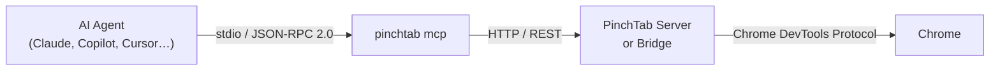

# MCP Server

This page describes how the PinchTab MCP server is structured internally and how it integrates with the rest of the stack.

## Overview

The MCP server is a thin stdio-based JSON-RPC 2.0 layer. It runs as a separate process (`pinchtab mcp`) and delegates every browser action to an already-running PinchTab instance via its REST API.



Key design decisions:

- **No direct Chrome dependency** — the MCP process has no CDP connection. All browser work is delegated to the PinchTab instance.
- **Any deployment works** — use `--server` flag to point at a local server, Docker container, or remote host.
- **Stateless protocol layer** — the MCP server holds no browser state itself; it is purely a translation adapter.

## Transport

The MCP server uses the **stdio transport** defined in the [MCP specification 2025-11-25](https://spec.modelcontextprotocol.io/). The AI client writes JSON-RPC requests to stdin and reads responses from stdout. Logs and diagnostics go to stderr.

This transport is universally supported by MCP clients (Claude Desktop, VS Code, Cursor, and any SDK-based client).

## Process Model

```
pinchtab mcp
  │
  ├── reads config port     (default http://127.0.0.1:9867)
  ├── --server flag         (override for remote servers)
  ├── reads PINCHTAB_TOKEN  (env or config)
  │
  ├── creates internal/mcp.Client  (HTTP client with 120 s timeout)
  ├── registers 38 MCP tools via mcp-go SDK
  └── calls server.ServeStdio()  (blocking read loop)
```

The process exits when stdin is closed by the client.

## Code Layout

```
internal/mcp/
├── server.go               # NewServer() wires tools → handlers; Serve() starts stdio
├── tools.go                # allTools() — JSON-schema tool definitions for all 38 tools
├── handlers.go             # handlerMap() — registers each tool's handler
├── handlers_helpers.go     # shared argument parsing / response helpers
├── handlers_navigation.go  # navigate, snapshot, frame, screenshot, get_text
├── handlers_interaction.go # click, type, press, hover, focus, select, scroll(_into_view), fill
├── handlers_content.go     # eval, pdf, find
├── handlers_tabs.go        # list_tabs, close_tab, health, cookies, connect_profile
├── handlers_wait.go        # wait, wait_for_selector/text/url/load/function
├── handlers_network.go     # network, network_detail/clear/route/unroute
├── handlers_dialog.go      # dialog
└── client.go               # Client — thin HTTP wrapper for PinchTab REST API

cmd/pinchtab/
└── cmd_mcp.go     # runMCP() — reads config, calls mcp.Serve()
```

### server.go

`NewServer` creates an `MCPServer` via the `mcp-go` SDK, iterates `allTools()`, looks up the matching handler in `handlerMap`, and calls `s.AddTool`. A panic fires at startup if a tool has no handler, preventing silent gaps.

`Serve` wraps `server.ServeStdio` for the normal execution path.

### tools.go

`allTools` returns a `[]mcp.Tool` slice. Each tool is declared with:

- a name (`pinchtab_*`)
- a human-readable description used by the LLM to select the right tool
- typed parameter schemas with `Required()` / `Description()` annotations

The declarations are grouped by category: Navigation, Interaction, Keyboard, Content, Tab Management, Wait utilities, Network, and Dialog.

### handlers.go

Each handler is a factory function returning a `func(context.Context, mcp.CallToolRequest) (*mcp.CallToolResult, error)` closure. Handlers:

1. Extract and validate arguments from `r.GetArguments()`
2. Build the corresponding PinchTab REST payload
3. Call `c.Get` or `c.Post` with the request context
4. Return `mcp.NewToolResultText` on success or `mcp.NewToolResultError` on HTTP 4xx/5xx

The context passed from the MCP SDK carries the client's deadline, so long-running navigations will be cancelled if the client disconnects.

### client.go

`Client` wraps `net/http` with:

- a 120-second timeout (covers page loads and PDF exports)
- optional `Authorization: Bearer <token>` header injection
- a 10 MB response body limit

URL validation lives in `handleNavigate` (`handlers_navigation.go`), which calls `internal/urls.Sanitize` to normalize bare hostnames to `https://` and reject non-HTTP(S) schemes (`file://`, `javascript:`, etc.).

## Tool Categories

| Category | Count | REST Endpoints Used |
|----------|-------|---------------------|
| Navigation | 5 | `/navigate`, `/snapshot`, `/frame`, `/screenshot`, `/text` |
| Interaction | 9 | `/action` |
| Keyboard | 4 | `/action` |
| Content | 3 | `/evaluate`, `/pdf`, `/find` |
| Tab Management | 5 | `/tabs`, `/health`, `/cookies`, `/profiles/{id}/instance` |
| Wait utilities | 6 | `/wait` |
| Network | 5 | `/network`, `/network/route` (POST/DELETE) |
| Dialog | 1 | `/dialog` |

## Security Considerations

- **`pinchtab_eval`** calls `/evaluate`, which requires `security.allowEvaluate: true` in the PinchTab config. It returns HTTP 403 by default. This is intentional — arbitrary JS execution is a separate opt-in from browser control.
- **`pinchtab_cookies`** calls `/cookies`, which requires `security.allowCookies: true`. Cookie values can expose session credentials, so cookie operations are disabled by default.
- **URL validation** — `pinchtab_navigate` rejects non-HTTP/HTTPS URLs to prevent SSRF via `file://`, `javascript:`, or custom schemes.
- **Token forwarding** — the MCP client forwards the configured bearer token to PinchTab, so access control at the PinchTab layer applies to all tool calls.
- **Wait caps** — `pinchtab_wait` and `pinchtab_wait_for_selector` enforce a 30-second maximum to prevent agent runaway.

## Related Pages

- [MCP User Guide](../mcp.md)
- [Architecture Overview](./index.md)
- [MCP Tool Reference](../reference/mcp-tools.md)
- [Security Guide](../guides/security.md)
