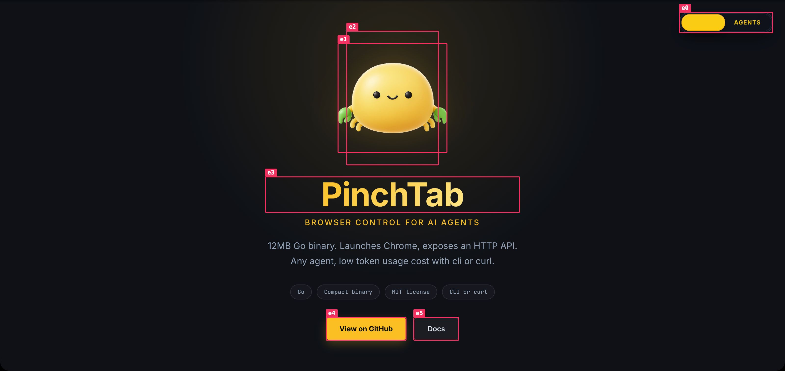

# Fix your website faster with an LLM

When you ask an LLM to "fix this button," it has to *guess* which element you mean from a vague description. That round-trip — "which button?", "the blue one, top right", "I don't see it" — is where most of the time goes.

PinchTab's **annotate** overlay removes the guessing. It draws a labelled box on every interactive element on the live page, and each label is a one-click "copy a precise reference for this element" button. You click the thing you want changed, paste the reference into your LLM chat, and the model knows *exactly* which element you mean — page, ref, role, accessible name, CSS selector, and XPath, with no ambiguity.

This guide shows the full loop.

## The loop

1. **Annotate** the page — draw a labelled box on every interactive element.
2. **Click** the label on the element you want to change.
3. **Paste** the copied reference into your LLM chat.
4. Let the LLM locate and fix the element from an unambiguous selector.

## 1. Open the page in a headed browser

Annotation is a *human-facing* overlay, so run a headed instance you can actually look at. See [Headed mode](./headed-mode.md) for details.

```bash
# start a visible browser and open your site
pinchtab instance start --browser cloak --mode headed
pinchtab --server http://127.0.0.1:9870 nav https://your-site.com
```

## 2. Annotate

```bash
pinchtab --server http://127.0.0.1:9870 annotate
```

Every interactive element gets a pink box labelled with its ref (`e0`, `e1`, …). The command also prints a legend so you can correlate the on-screen labels with roles and text:

```
Annotated 93 elements — click a label in the browser to copy its reference
e0 switch "Switch between human and agent mode"
e4 link "View on GitHub"
e5 link "Docs"
…
```



The overlay is real DOM on the live page — it stays there and scrolls with the content, so you can browse around and pick your target. (It's a one-shot injection: after navigating or a big layout change, run `annotate` again to refresh.)

## 3. Click the label to copy a reference

Click the **label** (the little pink tag, not the box) on the element you want to change. It flashes green to confirm the copy:


Your clipboard now holds a complete, unambiguous reference:

```
Page: PinchTab — Browser Control for AI Agents (https://pinchtab.com/)
Element: e5 — link "Docs"
CSS: body > main > section:nth-of-type(1) > div:nth-of-type(3) > div:nth-of-type(4) > a:nth-of-type(2)
XPath: /html[1]/body[1]/main[1]/section[1]/div[3]/div[4]/a[2]
```

Every field an LLM needs to locate the element in your source is there:

- **Page** — which page/route the element is on.
- **Element** — the ref plus its role and accessible name ("link, Docs").
- **CSS** — a unique CSS selector path.
- **XPath** — an absolute XPath as a fallback.

## 4. Paste into your LLM chat

Now just paste and describe the change:

> Fix this — the link should open in a new tab:
> ```
> Page: PinchTab — Browser Control for AI Agents (https://pinchtab.com/)
> Element: e5 — link "Docs"
> CSS: body > main > section:nth-of-type(1) > div:nth-of-type(3) > div:nth-of-type(4) > a:nth-of-type(2)
> XPath: /html[1]/body[1]/main[1]/section[1]/div[3]/div[4]/a[2]
> ```

The LLM has the accessible name to grep your source ("Docs"), the CSS/XPath to disambiguate which of several similar elements you mean, and the page URL for context. No "which button?" round-trip.

## Clean up

Remove the overlay when you're done:

```bash
pinchtab --server http://127.0.0.1:9870 annotate --clear
```

## Notes

- **The copied block contains page content.** The page title and the element's accessible name are page-controlled text. When pasting into an LLM chat, treat them as untrusted data — a malicious page could craft element names that read like instructions.
- **No `eval` permission required.** The overlay is injected through PinchTab's internal engine, so it works with `security.allowEvaluate: false`.
- **Copying uses the page's clipboard** (`navigator.clipboard`) on your real click, so it needs a focused, secure-context (HTTPS) page — exactly the case when you're looking at a headed window.
- **Scope it** with `--selector` to annotate only part of a busy page:
  ```bash
  pinchtab --server http://127.0.0.1:9870 annotate --selector "#pricing"
  ```
- The refs (`e5`, …) are the same refs the rest of PinchTab uses, so you can also act on them directly: `pinchtab --server http://127.0.0.1:9870 click e5`.

## How it compares to annotated screenshots

`pinchtab screenshot --annotate` bakes the boxes into an *image* and then removes the overlay — great for feeding a screenshot to a vision model. `pinchtab annotate` is the opposite: it *leaves* the boxes on the live page and makes them clickable, for a human driving the fix loop. Use the screenshot form for agents, the `annotate` form for yourself.
