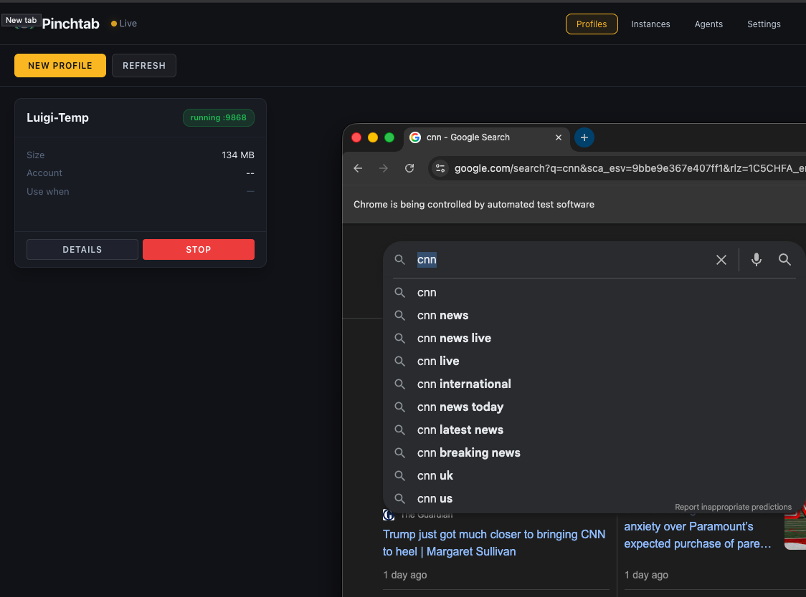
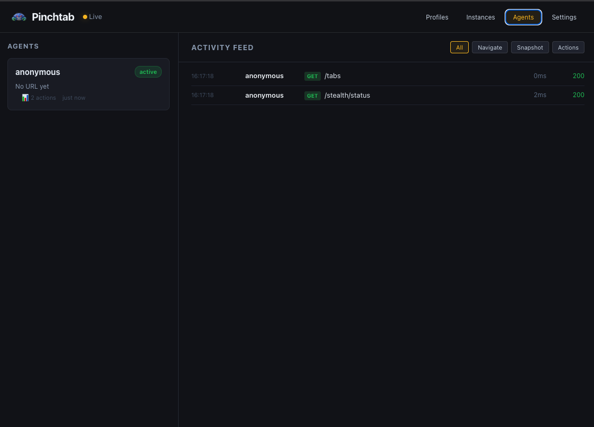

# Headed Mode

Most browser automation assumes you're either fully automated or fully manual. Real workflows aren't like that.

Your agent can fill out a 50-field form in seconds, but it can't solve a CAPTCHA. It can navigate to the right page, but it can't approve a bank transfer. It can scrape a dashboard, but first someone needs to log in with 2FA.

That's what headed mode is for.

## The Problem with Headless-Only

Headless browsers are great until they aren't. The moment you hit any of these, you're stuck:

- **Login walls** — OAuth flows, 2FA, SMS codes
- **CAPTCHAs** — reCAPTCHA, hCaptcha, Cloudflare challenges
- **Visual verification** — "does this look right?" before submitting
- **Sensitive actions** — payments, deletions, things you want a human to approve

The usual workaround? Copy cookies from a real browser, hope they don't expire, pray the session doesn't get flagged. Fragile, annoying, doesn't scale.

## How Pinchtab Solves It

Pinchtab's headed mode gives you a real Chrome window that both humans and agents share. Same browser, same session, same cookies. No hacks.

The flow is simple:

1. **Human** opens a profile, logs in, handles 2FA
2. **Agent** takes over via HTTP API — same browser, same session
3. **Human** can watch, intervene, or take back control at any time

The agent doesn't need screenshots to "see" the page. It reads the accessibility tree — the same structure screen readers use. Structured, fast, cheap on tokens.

## Profiles: Persistent Identity

Each Chrome profile is a complete browser identity — cookies, localStorage, saved passwords, extensions, everything. Pinchtab stores them in `~/.pinchtab/profiles/`.

Profiles persist across restarts. Log in once to Gmail on Monday, and your agent can read email on Friday without re-authenticating.

```bash
# List profiles
curl http://localhost:9867/profiles
```

```json
[
  {
    "id": "a1b2c3d4e5f6",
    "name": "Work",
    "accountEmail": "you@company.com",
    "accountName": "Your Name",
    "useWhen": "Work email and social accounts"
  }
]
```

Every profile gets a stable 12-character hex ID derived from its name. Use IDs in automation — they're URL-safe and won't break if you have spaces or special characters in profile names.

## Start and Stop with One Call

The orchestrator API makes profile management trivial for agents:

```bash
# List profiles (get profile ID)
curl http://localhost:9867/profiles | jq '.[] | {id, name}'

# Start a profile instance
curl -X POST http://localhost:9867/instances/start \
  -H "Content-Type: application/json" \
  -d '{"profileId":"a1b2c3d4e5f6"}'
```

**Response:**
```json
{
  "id": "inst_work123",
  "profileId": "a1b2c3d4e5f6",
  "profileName": "Work",
  "port": "9868",
  "status": "starting",
  "headless": false
}
```

The response tells you the instance ID. All your API calls go through the orchestrator proxy:

```bash
INST="inst_work123"

# Navigate (via orchestrator)
curl -X POST http://localhost:9867/instances/$INST/navigate \
  -d '{"url": "https://mail.google.com"}'

# Read the inbox
curl "http://localhost:9867/instances/$INST/snapshot"

# Done — shut it down
curl -X POST http://localhost:9867/instances/$INST/stop
```

You can also specify mode (headed/headless):

```bash
# Start profile in headless mode (faster, no display)
curl -X POST http://localhost:9867/instances/start \
  -H "Content-Type: application/json" \
  -d '{"profileId":"a1b2c3d4e5f6","mode":"headless"}'

# Start profile in headed mode (visible window, debug)
curl -X POST http://localhost:9867/instances/start \
  -H "Content-Type: application/json" \
  -d '{"profileId":"a1b2c3d4e5f6","mode":"headed"}'
```

## A Real Example: Reading Email

Here's what a full agent workflow looks like. The human already logged into Gmail through the profile once. Now the agent can check email any time:

```bash
# 1. Get profile ID
PROFILE_ID=$(curl -s http://localhost:9867/profiles \
  | jq -r '.[] | select(.name=="Work") | .id')

# 2. Start the profile instance
INST=$(curl -s -X POST http://localhost:9867/instances/start \
  -H "Content-Type: application/json" \
  -d '{"profileId":"'$PROFILE_ID'"}' | jq -r '.id')

# 3. Wait for instance to initialize
sleep 2

# 4. Navigate to Gmail (uses orchestrator proxy)
curl -s -X POST http://localhost:9867/instances/$INST/navigate \
  -d '{"url": "https://mail.google.com"}'

# 5. Read the inbox (accessibility tree, not screenshots)
curl -s "http://localhost:9867/instances/$INST/snapshot" | jq '.nodes[] | select(.role == "row") | .name' | head -5
```

**Output:**
```
"unread, GitHub, [org/repo] New pull request #42, 11:44 AM, ..."
"unread, Stripe, Your January invoice is ready, 11:26 AM, ..."
"unread, AWS, Your EC2 instance is running, 11:15 AM, ..."
```

No screenshots. No vision models. No token-heavy page dumps. Just structured data from the accessibility tree — the same way a screen reader would see it.

```bash
# 6. Clean up
curl -X POST http://localhost:9867/instances/$INST/stop
```

## When to Use Headed vs Headless

| Scenario | Mode | Why |
|---|---|---|
| First login to a service | **Headed** | Human handles 2FA/CAPTCHA |
| Daily email check | Either | Session persists, no login needed |
| Scraping public data | **Headless** | No human interaction needed |
| Filling forms with approval | **Headed** | Human reviews before submit |
| CI/CD automation | **Headless** | No display available |
| Debugging agent behavior | **Headed** | Watch what the agent does |

The key insight: you don't have to choose one mode forever. Start headed when you need human involvement, then switch to headless for routine automation. The profile carries the session either way.

## Dashboard & Control Plane

Running `pinchtab` gives you a web UI at `http://localhost:9867` for managing everything:

- Create and import Chrome profiles (persistent)
- Launch instances (headed or headless) with any profile
- Monitor running instances — status, tabs, logs, Chrome initialization
- View all agents connected to each instance
- Stop instances gracefully
- Real-time activity feed of all operations

The dashboard doesn't run Chrome itself. It's a lightweight orchestrator that manages profile instances as separate processes.

### Instances Tab — Monitor Your Running Browsers


The Instances tab shows all running browser instances:
- **Instance ID & Status** — Unique ID and current state (running/stopped)
- **Port** — Which port this instance is listening on
- **Mode** — headed or headless
- **Start Time** — When the instance launched
- **Controls** — DETAILS button for more info, STOP button to shut down

**Web UI:**
```bash
# Start orchestrator and dashboard
pinchtab

# Open in browser
open http://localhost:9867/dashboard
```

**CLI for agents:**
```bash
# List profiles
pinchtab profiles

# List running instances
pinchtab instances

# Start instance with profile
pinchtab instance launch  # Temporary profile
PROFILE_ID=$(pinchtab profiles | jq -r '.[] | select(.name=="Work") | .id')
curl -X POST http://localhost:9867/instances/start \
  -d '{"profileId":"'$PROFILE_ID'"}'
```

## Multiple Profiles, Multiple Agents

Nothing stops you from running several profiles at once. Different accounts, different purposes:

```bash
# Get profile IDs
WORK_ID=$(pinchtab profiles | jq -r '.[] | select(.name=="Work") | .id')
PERSONAL_ID=$(pinchtab profiles | jq -r '.[] | select(.name=="Personal") | .id')

# Start Work profile instance (headed for debugging)
WORK_INST=$(curl -s -X POST http://localhost:9867/instances/start \
  -H "Content-Type: application/json" \
  -d '{"profileId":"'$WORK_ID'","mode":"headed"}' | jq -r '.id')

# Start Personal profile instance (headless for automation)
PERSONAL_INST=$(curl -s -X POST http://localhost:9867/instances/start \
  -H "Content-Type: application/json" \
  -d '{"profileId":"'$PERSONAL_ID'","mode":"headless"}' | jq -r '.id')

# Start temporary instance (no persistent profile)
RESEARCH_INST=$(curl -s -X POST http://localhost:9867/instances/launch \
  -H "Content-Type: application/json" \
  -d '{"mode":"headless"}' | jq -r '.id')
```

Each gets its own port (auto-allocated), its own Chrome process, its own isolated session. The Profiles tab shows them running with their Chrome windows visible:



When you start a profile in headed mode:
- **Left panel** — Profile details (name, size, account info, status)
- **Right panel** — Live Chrome browser window
- **Status badge** — Shows it's running on port 9868
- **STOP button** — Gracefully shut down the instance

The Chrome window is a real browser — you or your agent can interact with it via the API while watching live. Perfect for debugging agent behavior or letting a human take over when needed.

Agents can work across multiple instances simultaneously:

```bash
# Agent A works on Work profile
curl -X POST http://localhost:9867/instances/$WORK_INST/navigate \
  -d '{"url":"https://work.slack.com"}'

# Agent B works on Personal profile at the same time
curl -X POST http://localhost:9867/instances/$PERSONAL_INST/navigate \
  -d '{"url":"https://twitter.com"}'

# Agent C uses temporary research instance
curl -X POST http://localhost:9867/instances/$RESEARCH_INST/navigate \
  -d '{"url":"https://google.com/search?q=..."}'

# All three isolated, no interference
```

---

Headed mode isn't about choosing between humans and agents. It's about letting them work together — each doing what they're best at. Humans handle the messy, contextual, trust-requiring parts. Agents handle the repetitive, fast, scale-requiring parts.

## Monitoring Agents Remotely

Here's where it gets interesting. Your agents are running on a server — a Mac Mini under your desk, a VPS, a home lab box. You're on your laptop, maybe on the couch, maybe in a coffee shop. You want to know what your agents are doing right now.

The dashboard gives you that. Open it in your browser and you get a real-time view of every agent, every profile, every action.

### Setting Up Remote Access

By default, PinchTab only listens on `127.0.0.1` — locked to the machine. To access the orchestrator and dashboard from another device on your network, you can set environment variables or bind to a different address.

**Simple setup (local network only):**
```bash
# Bind to all interfaces (only safe on private network!)
BRIDGE_BIND=0.0.0.0 pinchtab
```

**Secure setup (production):**
```bash
# Bind to all interfaces + require auth token
BRIDGE_BIND=0.0.0.0 BRIDGE_TOKEN=your-secret-token pinchtab
```

Now open `http://<server-ip>:9867/dashboard` from your laptop and you'll see the full dashboard.

With a token, every API call requires it:

```bash
curl http://192.168.1.100:9867/profiles \
  -H "Authorization: Bearer your-secret-token"
```

Without the token, requests get a `401` error. No exceptions.

**For production:** Consider running behind a reverse proxy (nginx) with HTTPS instead of exposing the orchestrator directly.

### What You See

The dashboard has several views:

**Instances** (default) — all running instances, their status, port, profile, Chrome mode (headed/headless). Click any instance to see:
- Instance metadata (ID, port, profile, status)
- Open tabs in that instance
- Instance logs (Chrome output, errors)
- Quick actions (navigate, take snapshot, stop)

**Profiles** — all profiles (persistent and temporary), their status, account info. Create new profiles, delete old ones, see which instances are using each profile.

**Agents** — every agent (identified by X-Agent-Id header) and which instance they're connected to. The Activity Feed shows a real-time stream of every navigate, snapshot, and action — filterable by type.

**Settings** — Configure orchestrator behavior, instance defaults, port ranges.

### The Activity Feed

The Activity Feed is the heartbeat of your agent fleet. Every action from every agent across every instance streams in real-time.



The Agents view shows:
- **Left panel** — List of connected agents with their status
- **Right panel** — Real-time activity feed filtered by action type
- **Filters** — Toggle between All, Navigate, Snapshot, and Actions
- **Status codes** — HTTP response codes (200, 404, etc.)
- **Timing** — How long each operation took

Example activity stream:

```
16:17:18  anonymous  GET  /tabs — 0ms — 200
16:17:18  anonymous  GET  /stealth/status — 2ms — 200
scraper → POST /navigate (inst_def456) — 31ms
scraper → GET /text (inst_def456) — 89ms
```

Filter by type — just navigations, just snapshots, just actions — to focus on what matters.

This works because the orchestrator collects events from all running instances and streams them to the dashboard via Server-Sent Events (SSE). You get one unified view even when agents are spread across multiple instances on different ports.

### Agent Identification

For agents to show up with a name in the dashboard instead of "anonymous", they just need to pass a header:

```bash
# Via orchestrator proxy
curl -X POST http://localhost:9867/instances/$INST/navigate \
  -H "X-Agent-Id: mario" \
  -H "Content-Type: application/json" \
  -d '{"url": "https://example.com"}'

# Or directly to instance
curl -X POST http://localhost:9868/navigate \
  -H "X-Agent-Id: mario" \
  -H "Content-Type: application/json" \
  -d '{"url": "https://example.com"}'
```

That's all it takes. The `X-Agent-Id` header tags every request, and the dashboard tracks it automatically. No registration, no config — just a header.

### Watching Live

Click on any running instance in the Instances tab to see a real-time screencast. The dashboard streams JPEG frames from Chrome's DevTools protocol directly to your browser. You see exactly what the agent sees — every page load, every click, every form fill.

This is useful for:

- **Debugging** — why did the agent click the wrong button? Watch it happen.
- **Trust** — your agent is buying something? Watch it fill in the details before it submits.
- **Fun** — there's something oddly satisfying about watching an AI browse the web.

**Note:** Screencast only works for headed instances (with visible Chrome window). Headless instances don't have a visual display to capture.

The screencast is lightweight — you can configure:
- Frames per second (1-15 FPS)
- Quality (10-80% JPEG compression)
- Max width (scale down for bandwidth)

Default settings use minimal bandwidth for remote monitoring.

### A Typical Remote Monitoring Setup

**On your server:**
```bash
# Start orchestrator, open to network, locked with token
BRIDGE_BIND=0.0.0.0 \
BRIDGE_TOKEN=my-secret-token \
pinchtab &

# Your agents start instances and work as usual
# They just pass X-Agent-Id headers so you can identify them
AGENT_ID=mario ./my-agent.sh
```

**On your laptop, phone, or tablet:**

1. Open `http://<server-ip>:9867/dashboard` in browser
2. Enter token when prompted
3. See all instances, profiles, agents in real-time
4. Click into any **headed** instance → see live screencast
5. Switch to Agents view → see real-time activity feed of all operations

No SSH tunnels. No VPN. No complex setup. Just a browser and a token.

**API calls from agents:**
```bash
# Agents identify themselves with X-Agent-Id header
curl -X POST http://orchestrator:9867/instances/$INST/navigate \
  -H "X-Agent-Id: mario" \
  -H "Content-Type: application/json" \
  -d '{"url": "https://example.com"}'
```

The dashboard automatically tracks which agent is doing what, where, and when.

## Security

Pinchtab binds to `127.0.0.1` by default — only accessible from the machine it's running on. This is intentional. Your agent runs on the same machine, so it just works. Nobody on your network can reach the dashboard or the API.

If you need remote access, set `BRIDGE_BIND=0.0.0.0` and **always** pair it with `BRIDGE_TOKEN`:

```bash
BRIDGE_BIND=0.0.0.0 BRIDGE_TOKEN=my-secret-token pinchtab dashboard
```

Without `BRIDGE_TOKEN`, every request is rejected with `401` — including the dashboard UI itself. There's no "public mode". If you open the bind address, you must set a token. This is by design.

For production setups, consider:

- Running behind a reverse proxy (nginx, Caddy) with HTTPS
- Using a strong, random token (`openssl rand -hex 32`)
- Restricting network access with firewall rules

That's the whole point. 🦀
